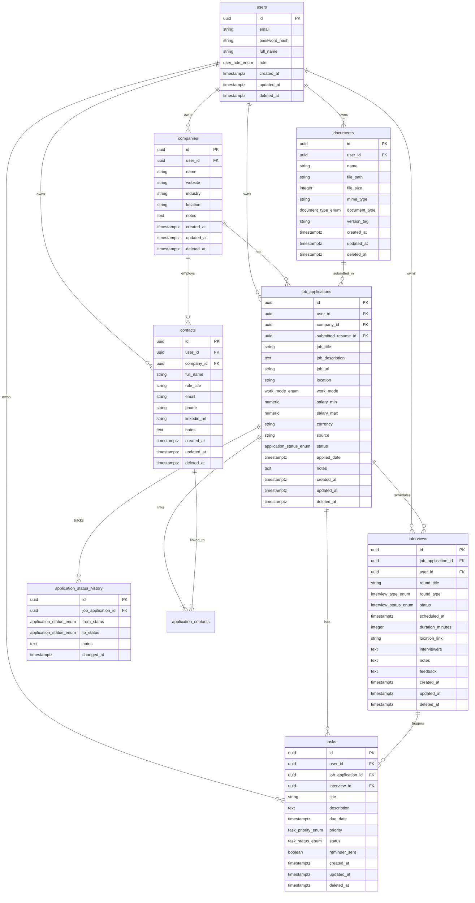

# Database Design Specification
## Job Application Tracker

---

## 1. Executive Summary & Design Philosophy

The **Job Application Tracker** relational database is constructed using PostgreSQL. The schema is designed with high data integrity, explicit constraints, multi-tenant security via strict `user_id` isolation, soft-deletion capabilities, and performance optimizations using strategic indexes.

### Core Architectural Decisions:
1. **UUID Primary Keys**: All entities utilize Universally Unique Identifiers (`UUID v4`) for primary keys to prevent enumeration attacks, facilitate safe data migrations, and decouple client-side ID generation.
2. **Strict Multi-Tenancy**: Every primary entity references `user_id` directly, enabling simple, performant user-level data isolation and row-level security policy enforcement.
3. **Auditability & Soft Deletes**: All data tables include standard timestamp fields (`created_at`, `updated_at`) and an optional soft-delete column (`deleted_at`).
4. **Explicit Application Pipeline History**: Status changes on job applications trigger immutable insert logs into an audit ledger (`application_status_history`).

---

## 2. PostgreSQL Custom Enum Types

```sql
-- User Role
CREATE TYPE user_role_enum AS ENUM ('USER', 'ADMIN');

-- Work Mode
CREATE TYPE work_mode_enum AS ENUM ('REMOTE', 'HYBRID', 'ON_SITE');

-- Application Status State Machine
CREATE TYPE application_status_enum AS ENUM (
    'SAVED',
    'APPLIED',
    'SCREENING',
    'ASSESSMENT',
    'INTERVIEW',
    'FINAL_INTERVIEW',
    'OFFER',
    'HIRED',
    'REJECTED',
    'WITHDRAWN'
);

-- Document Type
CREATE TYPE document_type_enum AS ENUM (
    'RESUME',
    'COVER_LETTER',
    'PORTFOLIO',
    'CERTIFICATE',
    'OTHER'
);

-- Interview Type
CREATE TYPE interview_type_enum AS ENUM (
    'PHONE_SCREEN',
    'TECHNICAL_SCREEN',
    'TAKE_HOME_ASSESSMENT',
    'SYSTEM_DESIGN',
    'CODING_ALGORITHM',
    'BEHAVIORAL',
    'MANAGERIAL',
    'CULTURE_FIT',
    'HR_FINAL',
    'OFFER_DISCUSSION'
);

-- Interview Status
CREATE TYPE interview_status_enum AS ENUM (
    'SCHEDULED',
    'COMPLETED',
    'CANCELLED',
    'RESCHEDULED'
);

-- Task Priority
CREATE TYPE task_priority_enum AS ENUM (
    'LOW',
    'MEDIUM',
    'HIGH',
    'URGENT'
);

-- Task Status
CREATE TYPE task_status_enum AS ENUM (
    'PENDING',
    'IN_PROGRESS',
    'COMPLETED',
    'CANCELLED'
);
```

---

## 3. Entity Schema Definitions

### 3.1 `users` Table
Stores registered platform users and credentials.

```sql
CREATE TABLE users (
    id UUID PRIMARY KEY DEFAULT gen_random_uuid(),
    email VARCHAR(255) NOT NULL UNIQUE,
    password_hash VARCHAR(255) NOT NULL,
    full_name VARCHAR(100) NOT NULL,
    role user_role_enum NOT NULL DEFAULT 'USER',
    created_at TIMESTAMPTZ NOT NULL DEFAULT CURRENT_TIMESTAMP,
    updated_at TIMESTAMPTZ NOT NULL DEFAULT CURRENT_TIMESTAMP,
    deleted_at TIMESTAMPTZ DEFAULT NULL
);
```

### 3.2 `companies` Table
Directory of target employer companies per user.

```sql
CREATE TABLE companies (
    id UUID PRIMARY KEY DEFAULT gen_random_uuid(),
    user_id UUID NOT NULL REFERENCES users(id) ON DELETE CASCADE,
    name VARCHAR(150) NOT NULL,
    website VARCHAR(255),
    industry VARCHAR(100),
    location VARCHAR(150),
    notes TEXT,
    created_at TIMESTAMPTZ NOT NULL DEFAULT CURRENT_TIMESTAMP,
    updated_at TIMESTAMPTZ NOT NULL DEFAULT CURRENT_TIMESTAMP,
    deleted_at TIMESTAMPTZ DEFAULT NULL
);
```

### 3.3 `contacts` Table
Recruiters, HR managers, and referrals associated with companies and users.

```sql
CREATE TABLE contacts (
    id UUID PRIMARY KEY DEFAULT gen_random_uuid(),
    user_id UUID NOT NULL REFERENCES users(id) ON DELETE CASCADE,
    company_id UUID REFERENCES companies(id) ON DELETE SET NULL,
    full_name VARCHAR(100) NOT NULL,
    role_title VARCHAR(100),
    email VARCHAR(255),
    phone VARCHAR(50),
    linkedin_url VARCHAR(255),
    notes TEXT,
    created_at TIMESTAMPTZ NOT NULL DEFAULT CURRENT_TIMESTAMP,
    updated_at TIMESTAMPTZ NOT NULL DEFAULT CURRENT_TIMESTAMP,
    deleted_at TIMESTAMPTZ DEFAULT NULL
);
```

### 3.4 `documents` Table
User document versions (Resumes, Cover Letters, Portfolios).

```sql
CREATE TABLE documents (
    id UUID PRIMARY KEY DEFAULT gen_random_uuid(),
    user_id UUID NOT NULL REFERENCES users(id) ON DELETE CASCADE,
    name VARCHAR(150) NOT NULL,
    file_path VARCHAR(500) NOT NULL,
    file_size INTEGER NOT NULL,
    mime_type VARCHAR(100) NOT NULL,
    document_type document_type_enum NOT NULL DEFAULT 'RESUME',
    version_tag VARCHAR(50),
    created_at TIMESTAMPTZ NOT NULL DEFAULT CURRENT_TIMESTAMP,
    updated_at TIMESTAMPTZ NOT NULL DEFAULT CURRENT_TIMESTAMP,
    deleted_at TIMESTAMPTZ DEFAULT NULL
);
```

### 3.5 `job_applications` Table
Core entity tracking job applications.

```sql
CREATE TABLE job_applications (
    id UUID PRIMARY KEY DEFAULT gen_random_uuid(),
    user_id UUID NOT NULL REFERENCES users(id) ON DELETE CASCADE,
    company_id UUID NOT NULL REFERENCES companies(id) ON DELETE RESTRICT,
    submitted_resume_id UUID REFERENCES documents(id) ON DELETE SET NULL,
    job_title VARCHAR(150) NOT NULL,
    job_description TEXT,
    job_url VARCHAR(500),
    location VARCHAR(150),
    work_mode work_mode_enum NOT NULL DEFAULT 'REMOTE',
    salary_min NUMERIC(12, 2),
    salary_max NUMERIC(12, 2),
    currency VARCHAR(3) DEFAULT 'USD',
    source VARCHAR(100),
    status application_status_enum NOT NULL DEFAULT 'SAVED',
    applied_date TIMESTAMPTZ,
    notes TEXT,
    created_at TIMESTAMPTZ NOT NULL DEFAULT CURRENT_TIMESTAMP,
    updated_at TIMESTAMPTZ NOT NULL DEFAULT CURRENT_TIMESTAMP,
    deleted_at TIMESTAMPTZ DEFAULT NULL,
    CONSTRAINT chk_salary_range CHECK (salary_min IS NULL OR salary_max IS NULL OR salary_min <= salary_max)
);
```

### 3.6 `application_contacts` Table
Junction table mapping multi-to-multi relationships between job applications and contacts.

```sql
CREATE TABLE application_contacts (
    job_application_id UUID NOT NULL REFERENCES job_applications(id) ON DELETE CASCADE,
    contact_id UUID NOT NULL REFERENCES contacts(id) ON DELETE CASCADE,
    PRIMARY KEY (job_application_id, contact_id)
);
```

### 3.7 `application_status_history` Table
Immutable history tracking status transitions for applications.

```sql
CREATE TABLE application_status_history (
    id UUID PRIMARY KEY DEFAULT gen_random_uuid(),
    job_application_id UUID NOT NULL REFERENCES job_applications(id) ON DELETE CASCADE,
    from_status application_status_enum,
    to_status application_status_enum NOT NULL,
    notes TEXT,
    changed_at TIMESTAMPTZ NOT NULL DEFAULT CURRENT_TIMESTAMP
);
```

### 3.8 `interviews` Table
Scheduled interview rounds attached to job applications.

```sql
CREATE TABLE interviews (
    id UUID PRIMARY KEY DEFAULT gen_random_uuid(),
    job_application_id UUID NOT NULL REFERENCES job_applications(id) ON DELETE CASCADE,
    user_id UUID NOT NULL REFERENCES users(id) ON DELETE CASCADE,
    round_title VARCHAR(150) NOT NULL,
    round_type interview_type_enum NOT NULL DEFAULT 'TECHNICAL_SCREEN',
    status interview_status_enum NOT NULL DEFAULT 'SCHEDULED',
    scheduled_at TIMESTAMPTZ NOT NULL,
    duration_minutes INTEGER NOT NULL DEFAULT 60,
    location_link VARCHAR(500),
    interviewers TEXT,
    notes TEXT,
    feedback TEXT,
    created_at TIMESTAMPTZ NOT NULL DEFAULT CURRENT_TIMESTAMP,
    updated_at TIMESTAMPTZ NOT NULL DEFAULT CURRENT_TIMESTAMP,
    deleted_at TIMESTAMPTZ DEFAULT NULL
);
```

### 3.9 `tasks` Table
Follow-up tasks and automated reminders.

```sql
CREATE TABLE tasks (
    id UUID PRIMARY KEY DEFAULT gen_random_uuid(),
    user_id UUID NOT NULL REFERENCES users(id) ON DELETE CASCADE,
    job_application_id UUID REFERENCES job_applications(id) ON DELETE CASCADE,
    interview_id UUID REFERENCES interviews(id) ON DELETE CASCADE,
    title VARCHAR(200) NOT NULL,
    description TEXT,
    due_date TIMESTAMPTZ NOT NULL,
    priority task_priority_enum NOT NULL DEFAULT 'MEDIUM',
    status task_status_enum NOT NULL DEFAULT 'PENDING',
    reminder_sent BOOLEAN NOT NULL DEFAULT FALSE,
    created_at TIMESTAMPTZ NOT NULL DEFAULT CURRENT_TIMESTAMP,
    updated_at TIMESTAMPTZ NOT NULL DEFAULT CURRENT_TIMESTAMP,
    deleted_at TIMESTAMPTZ DEFAULT NULL
);
```

---

## 4. Entity-Relationship (ER) Diagram



---

## 5. Performance Indexes

To support rapid filtering, dashboard aggregation queries, and foreign key joins, the following indexes are declared:

```sql
-- User isolation indexes
CREATE INDEX idx_companies_user_id ON companies(user_id) WHERE deleted_at IS NULL;
CREATE INDEX idx_contacts_user_id ON contacts(user_id) WHERE deleted_at IS NULL;
CREATE INDEX idx_documents_user_id ON documents(user_id) WHERE deleted_at IS NULL;

-- Job Application filtering & dashboard analytics indexes
CREATE INDEX idx_job_apps_user_status ON job_applications(user_id, status) WHERE deleted_at IS NULL;
CREATE INDEX idx_job_apps_user_applied_date ON job_applications(user_id, applied_date) WHERE deleted_at IS NULL;
CREATE INDEX idx_job_apps_user_source ON job_applications(user_id, source) WHERE deleted_at IS NULL;
CREATE INDEX idx_job_apps_company_id ON job_applications(company_id);

-- Status history sequence index
CREATE INDEX idx_status_history_app_changed ON application_status_history(job_application_id, changed_at DESC);

-- Interview scheduling & reminder indexes
CREATE INDEX idx_interviews_user_scheduled ON interviews(user_id, scheduled_at) WHERE deleted_at IS NULL;
CREATE INDEX idx_interviews_app_id ON interviews(job_application_id);

-- Tasks queue & reminder polling index
CREATE INDEX idx_tasks_due_reminder ON tasks(due_date, reminder_sent, status) WHERE deleted_at IS NULL AND reminder_sent = FALSE;
CREATE INDEX idx_tasks_user_status ON tasks(user_id, status) WHERE deleted_at IS NULL;
```

---

## 6. Foreign Key Cascade & Delete Behavior Matrix

| Parent Table | Child Table | Foreign Key | Cascade / Delete Rule | Rationale |
| :--- | :--- | :--- | :--- | :--- |
| `users` | `companies` | `user_id` | `ON DELETE CASCADE` | Removing a user purges all user data. |
| `users` | `job_applications` | `user_id` | `ON DELETE CASCADE` | Removing a user purges all application records. |
| `companies` | `job_applications` | `company_id` | `ON DELETE RESTRICT` | Prevents accidental deletion of a company with active applications. |
| `documents` | `job_applications` | `submitted_resume_id` | `ON DELETE SET NULL` | Deleting a resume entity retains application data; sets link to null. |
| `companies` | `contacts` | `company_id` | `ON DELETE SET NULL` | Deleting a company keeps contact in directory with null company. |
| `job_applications` | `application_status_history` | `job_application_id` | `ON DELETE CASCADE` | Deleting an application deletes its transition history. |
| `job_applications` | `interviews` | `job_application_id` | `ON DELETE CASCADE` | Deleting an application deletes its scheduled interviews. |
| `job_applications` | `tasks` | `job_application_id` | `ON DELETE CASCADE` | Deleting an application deletes linked follow-up tasks. |
| `interviews` | `tasks` | `interview_id` | `ON DELETE CASCADE` | Deleting an interview deletes linked preparation tasks. |

---

## 7. Database Design Rationale

1. **Explicit Junction Table for Contacts (`application_contacts`)**: Multiple recruiters or team members may participate in an application process. Decoupling contacts from applications allows a recruiter to be linked to multiple applications over time without duplicate contact records.
2. **Denormalized User IDs on Dependent Entities**: Including `user_id` on `interviews` and `tasks` simplifies user-isolated queries (e.g., "get all upcoming tasks for user X") without requiring multi-join traversals through `job_applications`.
3. **PostgreSQL Custom Enums vs. Reference Tables**: Enums provide strong static type safety, reduced storage footprint, and clean TypeORM/Prisma mapping without additional JOIN overhead.
