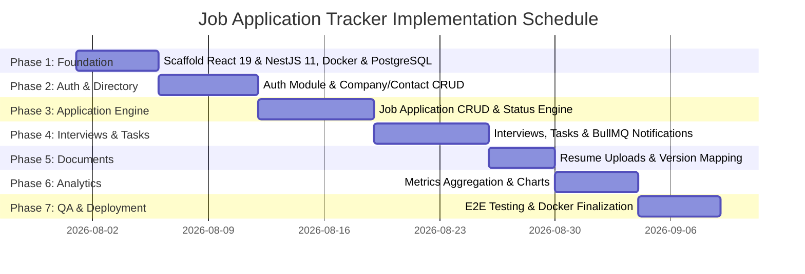

# Development & Implementation Plan
## Job Application Tracker

---

## 1. Project Overview & Strategy

The development plan outlines a phased, incremental approach to building the **Job Application Tracker**. The codebase is structured as a decoupled workspace with `frontend/` (React 19 + JavaScript / JSX + Vite 8), `backend/` (NestJS 11 + TypeScript 5.7), and `docs/` (documentation).

---

## 2. Monorepo Directory Architecture

```
job-application-tracker/
├── backend/                  # NestJS 11 Backend API Service (TypeScript 5.7)
├── frontend/                 # React 19 JavaScript / JSX (Vite 8) Frontend App
└── docs/                     # Technical System & Architecture Documentation
```

---

## 3. Development Roadmap & Milestones



---

## 4. Phase Breakdown & Implementation Order

### Phase 1: System Foundation & Infrastructure (Days 1–5)
* **Goal**: Establish project repositories, Docker environment, and PostgreSQL database initialization.
* **Backend Tasks (`backend/`)**:
  1. Verify NestJS 11 setup (`src/app.module.ts`, `src/main.ts`).
  2. Setup TypeORM / Prisma with PostgreSQL 16 connection pooling.
  3. Create SQL schema migration scripts for custom Enums and initial tables (`users`, `companies`, `contacts`, `documents`, `job_applications`, `application_status_history`, `application_contacts`, `interviews`, `tasks`).
  4. Configure global NestJS `ValidationPipe`, `HttpExceptionFilter`, and logging interceptors.
* **Frontend Tasks (`frontend/`)**:
  1. Verify Vite 8 + React 19 (JavaScript / JSX) setup (`App.jsx`, `main.jsx`).
  2. Setup Axios API client with base URL configuration and global error handling.
  3. Define core UI design system (TailwindCSS, Colors, Typography, Reusable Button, Input, Modal components).

---

### Phase 2: Authentication & Company Directory (Days 6–11)
* **Goal**: User onboarding, session security, and basic entity directories.
* **Backend Tasks**:
  1. Build `UsersModule` and `AuthModule`.
  2. Implement bcrypt password hashing, JwtStrategy, LocalStrategy, and HttpOnly refresh cookie logic.
  3. Implement `CompaniesModule` (CRUD API with search pagination).
  4. Implement `ContactsModule` (CRUD API linked to Companies).
* **Frontend Tasks**:
  1. Build Auth pages (Login, Register) with Zustand session state.
  2. Configure Axios refresh token interceptor.
  3. Build Company Directory view and modal forms for adding/editing companies and contacts.

---

### Phase 3: Application Pipeline & Status Engine (Days 12–18)
* **Goal**: Core application management capability with Kanban board and transition logs.
* **Backend Tasks**:
  1. Implement `ApplicationsModule` CRUD controllers and services.
  2. Write status transition state machine logic enforcing validation rules (`BR-001` to `BR-006`).
  3. Implement automatic insert trigger into `application_status_history` on status mutation.
  4. Add advanced filtering query parameters (`status`, `workMode`, `search`, `appliedDate`).
* **Frontend Tasks**:
  1. Build Applications List View with data tables, sorting, and pagination.
  2. Build interactive **Kanban Board** with drag-and-drop status column updates.
  3. Build Application Detail Drawer showing status timeline history.

---

### Phase 4: Interviews, Tasks & BullMQ Reminders (Days 19–25)
* **Goal**: Interview scheduling and automated reminder notifications.
* **Backend Tasks**:
  1. Build `InterviewsModule` (Schedule rounds, capture feedback notes).
  2. Build `TasksModule` (Create follow-up tasks with priority and due date).
  3. Integrate Redis 7 and BullMQ (`QueueModule`).
  4. Create `ReminderProcessor` worker class to send emails via Nodemailer for due tasks/interviews.
* **Frontend Tasks**:
  1. Add Interview round manager inside Application Detail View.
  2. Build global Task Manager list and calendar view with quick-complete checkboxes.

---

### Phase 5: Document Management & Resume Versioning (Days 26–29)
* **Goal**: Upload and associate tailored resume versions with job applications.
* **Backend Tasks**:
  1. Implement `DocumentsModule` with Multer file upload storage abstraction.
  2. Implement `LocalStorageService` to store PDFs in secure upload directory.
  3. Link `submitted_resume_id` on `job_applications`.
* **Frontend Tasks**:
  1. Build Document Manager page to upload and tag resumes (`v1`, `v2-Frontend`).
  2. Add resume selector dropdown when creating or editing a Job Application.

---

### Phase 6: Dashboard Analytics & Visual Metrics (Days 30–34)
* **Goal**: Provide insights into application conversions and performance.
* **Backend Tasks**:
  1. Implement `AnalyticsModule` executing optimized SQL aggregate queries.
  2. Build endpoints for overall KPIs, conversion rates, status distributions, source performance, and application velocity.
* **Frontend Tasks**:
  1. Integrate Recharts or Chart.js visual charting library.
  2. Construct Analytics Dashboard page displaying summary metric cards, donut charts, and bar graphs.

---

### Phase 7: Testing, Dockerization & Production Release (Days 35–39)
* **Goal**: System hardening, automated testing, and container deployment.
* **Tasks**:
  1. Write backend unit tests for `ApplicationsService` and status state machine.
  2. Write integration tests for API endpoints using Supertest.
  3. Configure production `docker-compose.yml` bundling Nginx, React 19 static build, NestJS 11 API, NestJS BullMQ Worker, PostgreSQL 16, and Redis 7.
  4. Conduct load testing and index tuning.

---

## 5. MVP Definition vs. Future Enhancements

### 5.1 Minimum Viable Product (MVP Scope)
* Full Authentication (Register, Login, Silent Token Refresh).
* Company & Contact management.
* Application Pipeline with 10 statuses, Kanban board, and timeline history.
* Multistage Interview tracking with notes.
* Tasks and automated email reminders via BullMQ.
* Document upload (Resume versions) linked to applications.
* Essential Analytics Dashboard (Total Apps, Conversions, Source performance).
* Containerized deployment environment.

### 5.2 Future Enhancements Roadmap (Post-MVP)
1. **Chrome Extension Integration**: One-click job capture directly from LinkedIn/Indeed pages.
2. **Google & Outlook Calendar Sync**: Bi-directional sync for scheduled interview rounds.
3. **AI-Powered Resume Analysis**: Natural Language Processing (NLP) to compare resume text against job descriptions and highlight keyword gaps.
4. **Gmail Auto-Ingest**: Ingest rejection and interview request emails automatically using Gmail API.
5. **Salary Negotiation Tracker**: Log offer compensation details (Base, Bonus, Equity) and compare counter-offers.
