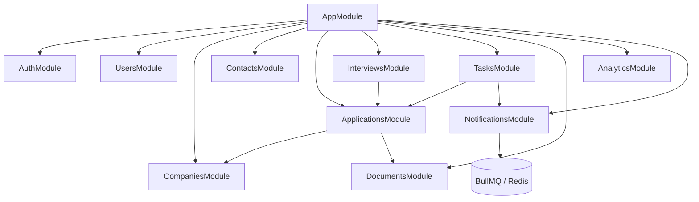
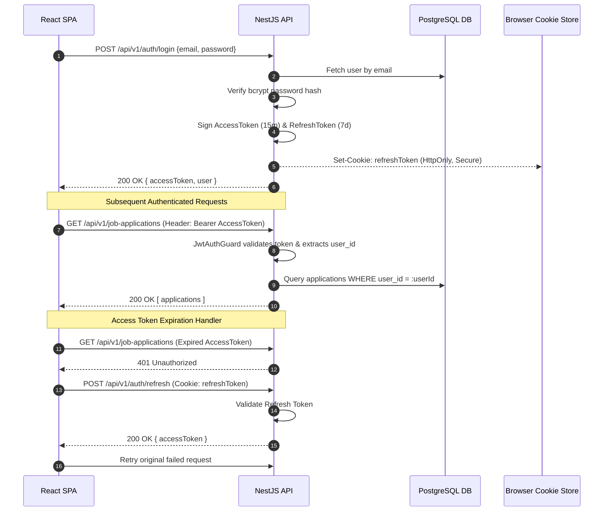
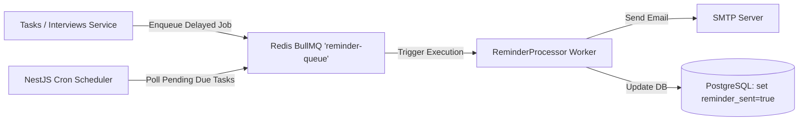
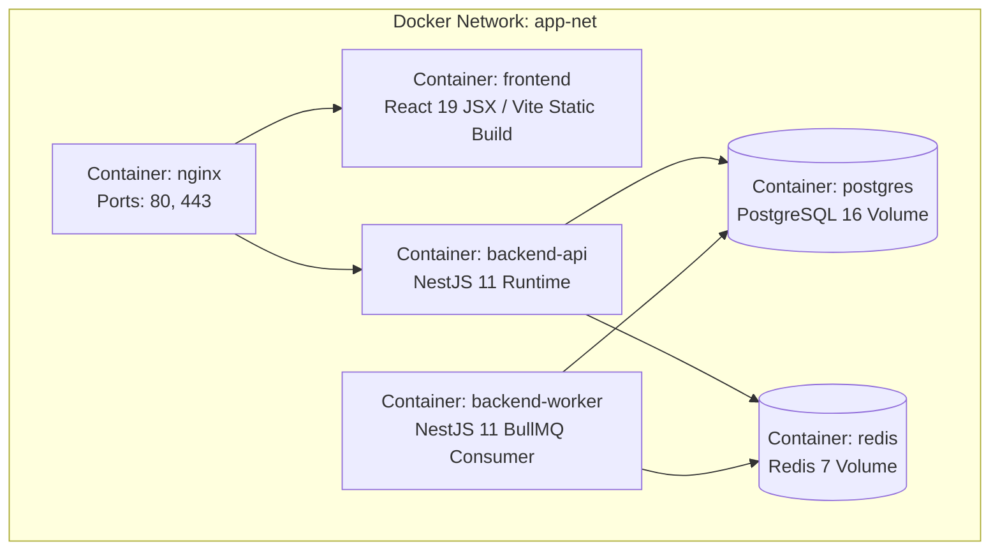

# System Design & Architecture Specification
## Job Application Tracker

---

## 1. High-Level System Architecture

The **Job Application Tracker** follows a modern, multi-tier decoupled architecture comprising a single-page client application (React + JavaScript / JSX + Vite 8), a modular RESTful backend API (NestJS 11 + TypeScript 5.7), an active/relational storage layer (PostgreSQL 16), an in-memory key-value queue broker (Redis 7 + BullMQ), and background worker processors.

```mermaid
flowchart TB
    subgraph Client Tier
        FE[React JavaScript / JSX SPA\n(Vite 8, TailwindCSS, TanStack Query v5)]
    end

    subgraph Edge & API Tier
        NGINX[Nginx Reverse Proxy / Load Balancer]
        BE[NestJS 11 REST API Gateway & Application Services\n(Modular Domain Controller / Service)]
    end

    subgraph Data & Storage Tier
        DB[(PostgreSQL 16\nPrimary Relational Database)]
        REDIS[(Redis 7\nCache & BullMQ Queue Store)]
        FS[Local Disk / Object Storage\nUploaded Resume PDFs]
    end

    subgraph Async Worker Tier
        WORKER[NestJS 11 BullMQ Background Worker\n(Email & Task Notification Processor)]
        SMTP[SMTP Email Provider / Nodemailer]
    end

    FE -->|HTTPS / REST API| NGINX
    NGINX -->|HTTP / localhost:3000| BE
    BE -->|TypeORM / SQL| DB
    BE -->|Read/Write Session & Queue Jobs| REDIS
    BE -->|Multer File I/O| FS
    WORKER -->|Poll Job Queues| REDIS
    WORKER -->|Dispatch Emails| SMTP
```

---

## 2. Monorepo Repository Structure

The codebase is organized as a clean decoupled workspace with distinct `frontend`, `backend`, and `docs` directories:

```
job-application-tracker/
├── backend/                  # NestJS 11 Backend API Service (TypeScript)
│   ├── src/
│   │   ├── modules/          # Domain Feature Modules (Auth, Applications, etc.)
│   │   ├── common/           # Decorators, Filters, Guards, Interceptors
│   │   ├── config/           # Environment Configuration & Validation
│   │   ├── database/         # Database Migrations & Entities
│   │   ├── app.controller.ts # Root Controller
│   │   ├── app.module.ts     # Root Module Assembly
│   │   ├── app.service.ts    # Root Service
│   │   └── main.ts           # NestJS Server Bootstrapper
│   ├── test/                 # E2E & Unit Test Configurations
│   ├── package.json          # NestJS 11 & Node Dependencies
│   ├── tsconfig.json         # TypeScript 5.7 Compiler Configuration
│   └── nest-cli.json         # Nest CLI Config
│
├── frontend/                 # React JavaScript / JSX (Vite 8) Client App
│   ├── src/
│   │   ├── assets/           # Static media, SVG icons, brand assets
│   │   ├── components/       # Reusable UI component library (Buttons, Modals, Cards)
│   │   ├── features/         # Feature-sliced domain modules (applications, auth, etc.)
│   │   ├── hooks/            # Custom React Hooks
│   │   ├── services/         # Axios HTTP Client & API Service layer
│   │   ├── stores/           # Zustand state management
│   │   ├── utils/            # Helper utilities and validators
│   │   ├── App.jsx           # Main Application Component
│   │   ├── main.jsx          # React 19 Entrypoint
│   │   ├── App.css           # Component styles
│   │   └── index.css         # Global Styles & Design Tokens
│   ├── index.html            # Vite HTML Template
│   ├── package.json          # React & Vite 8 Dependencies
│   └── vite.config.js        # Vite Build Configuration
│
└── docs/                     # Technical System & Architecture Documentation
    ├── SRS.md
    ├── DATABASE_DESIGN.md
    ├── SYSTEM_DESIGN.md
    ├── API_SPECIFICATION.md
    └── DEVELOPMENT_PLAN.md
```

---

## 3. Frontend Architecture (React JavaScript / JSX + Vite 8)

The client application is built with React 19 (JavaScript / JSX), Vite 8, TanStack Query (React Query v5), TailwindCSS, and React Router v6.

### State Management Strategy:
* **Server State**: Managed exclusively via **TanStack Query (React Query v5)** for caching, automatic background refetching, optimistic updates (e.g., dragging Kanban cards), and mutation handling.
* **Client/UI State**: Managed via **Zustand** for transient UI states (sidebar collapsed, active filters, open drawers) and active user session token context.

---

## 4. Backend Architecture (NestJS 11 + TypeScript 5.7)

The backend is built with NestJS 11, adhering to Domain-Driven Design (DDD) principles with modular architecture. Each domain feature encapsulates its Controller, Service, Entity, DTOs, and Repository layers.

### NestJS Core Modules Diagram:



---

## 5. Authentication & Authorization Flow

The application implements dual-token JWT authentication with enhanced security.

1. **Access Token**: Short-lived JWT (15-minute expiration) signed with `JWT_SECRET`. Sent in client HTTP headers (`Authorization: Bearer <token>`).
2. **Refresh Token**: Long-lived JWT (7-day expiration) signed with `JWT_REFRESH_SECRET`. Stored securely in an `HttpOnly`, `Secure`, `SameSite=Strict` cookie.
3. **Silent Refresh**: Client Axios interceptor captures `401 Unauthorized` responses and automatically hits `/api/v1/auth/refresh` to fetch a new access token without user disruption.



---

## 6. Redis & BullMQ Asynchronous Job Processing

Redis 7 serves as the message queue storage layer powering **BullMQ** job processors.

### Task & Interview Reminder Queue Architecture:
1. **Producer**: When a task or interview with a `due_date` or `scheduled_at` is created, `NotificationsService` enqueues a delayed job into the `reminder-queue` with `delay = targetTime - currentTime - 24Hours`.
2. **Cron Scheduler**: A NestJS cron job (`@Cron('*/15 * * * *')`) regularly sweeps for pending tasks due in the next hour that haven't had reminders queued.
3. **Consumer Worker**: The `ReminderProcessor` picks up triggered jobs from Redis, formats an HTML email template, and dispatches it via Nodemailer/SMTP.



---

## 7. Document & File Storage Architecture

For the MVP, files are uploaded via standard HTTP `multipart/form-data` handled by NestJS `FileInterceptor` (Multer).

* **Storage Abstraction**: File upload operations are abstracted behind a `StorageService` interface:
  ```typescript
  export interface StorageService {
    uploadFile(file: Express.Multer.File, path: string): Promise<string>;
    deleteFile(filePath: string): Promise<void>;
    getFileStream(filePath: string): Promise<NodeJS.ReadableStream>;
  }
  ```
* **Local Disk Driver (`LocalStorageService`)**: Saves uploaded PDFs to disk under `./uploads/documents/:userId/`.
* **Future Cloud Driver (`S3StorageService`)**: Implements the same interface to upload directly to an AWS S3 Bucket or MinIO instance without modifying controller logic.

---

## 8. Logging, Monitoring & Error Handling

1. **Structured Logging**: Standard NestJS logger wrapped with `Winston` or `Pino` to produce structured JSON logs in production (`timestamp`, `level`, `context`, `traceId`, `userId`, `message`).
2. **Global Exception Filter**: `HttpExceptionFilter` intercepts all unhandled errors, transforming them into a standard error schema:
   ```json
   {
     "statusCode": 400,
     "timestamp": "2026-07-27T17:00:00.000Z",
     "path": "/api/v1/job-applications",
     "error": "Bad Request",
     "message": ["salaryMin must not be greater than salaryMax"]
   }
   ```
3. **Health Checks**: NestJS `@nestjs/terminus` endpoint `/api/v1/health` monitors PostgreSQL connection pool, Redis ping, and disk storage availability.

---

## 9. Docker Containerization & Deployment

The application is fully containerized using Docker and organized with `docker-compose`.



### Docker Compose Service Topology:
* `postgres`: PostgreSQL 16 image with persistent volume `pgdata`.
* `redis`: Redis 7 Alpine image with persistent volume `redisdata`.
* `backend-api`: NestJS API container running `npm run start:prod`.
* `backend-worker`: NestJS worker entrypoint consuming BullMQ queues.
* `frontend`: Production build served via Nginx static Web server.
* `nginx-proxy`: Edge reverse proxy routing `/` to `frontend` and `/api` to `backend-api`.
